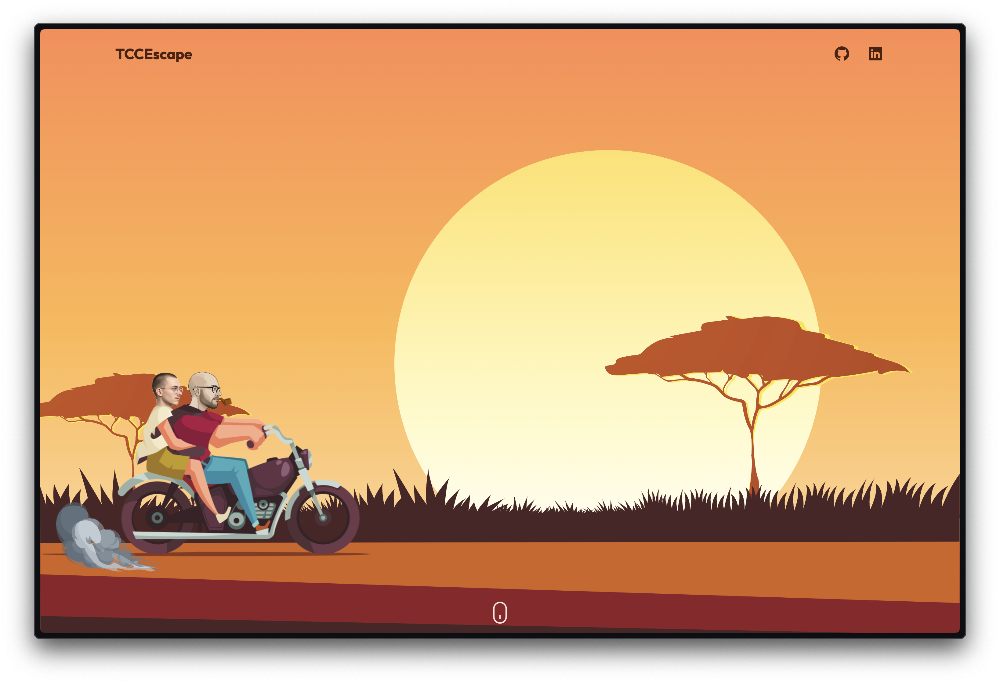
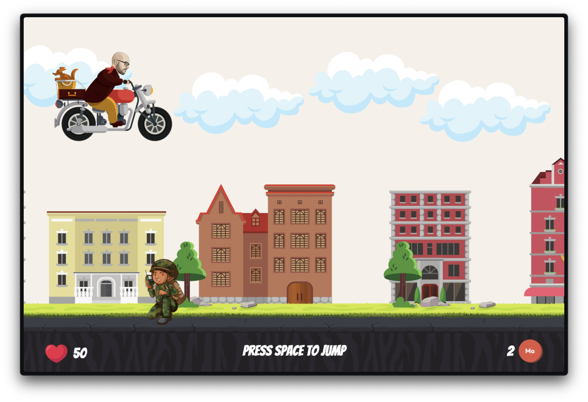
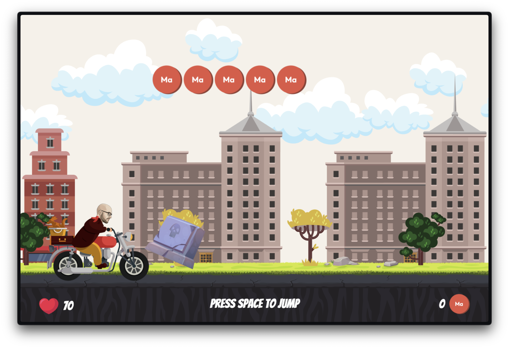
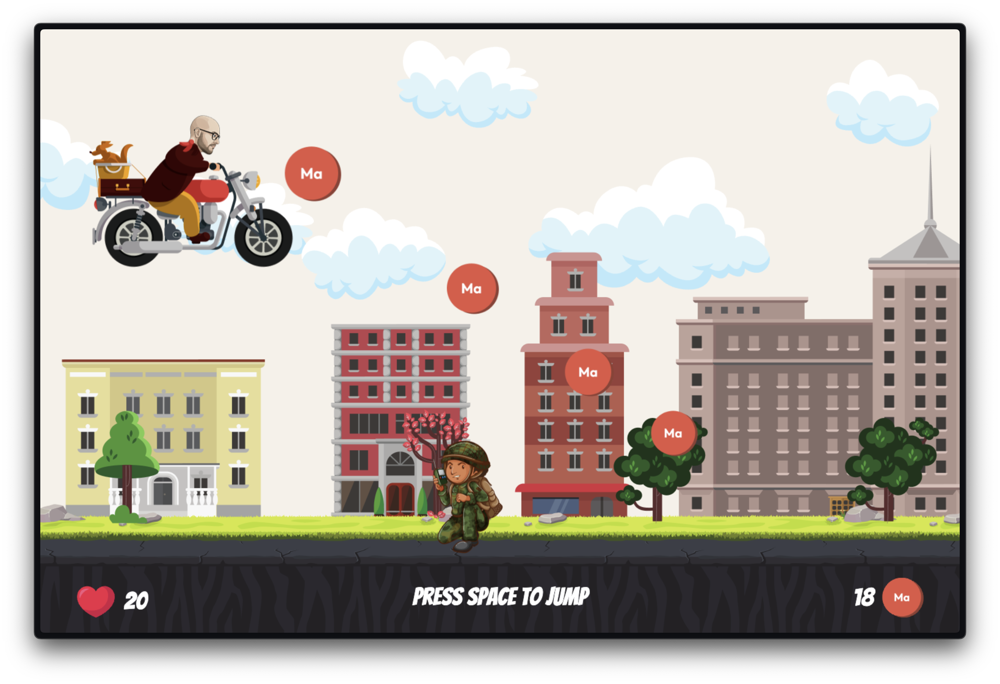
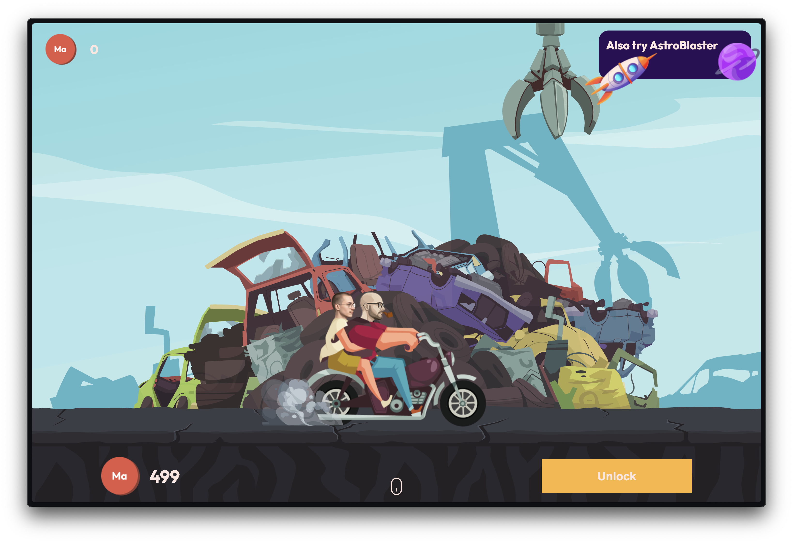

# TCC-Chase-Game 🛵

**TCC-Chase-Game** is a  web game about a coach on a bicycle escaping TCC employees across Ukraine. Inspired by a legendary frontend coach from MATE Academy **Kyrylo Haiduk**.

> 🎮 Play the live demo here: [https://aiiyuu.github.io/tcc-chase-game/](https://aiiyuu.github.io/tcc-chase-game/)

---

## Game Overview 🚴‍♂️💨

**Kyrylo Haiduk** is a skilled coach at **Mate Academy** who is being chased by TCC employers across the streets of Ukraine 🇺🇦. Help Kyrylo escape on his bicycle 🚲 by avoiding obstacles (TCC employees) 🏃‍♂️ and earning points along the way 🎯. The game becomes progressively harder as you advance ⏩. Use your earnings 💵 to upgrade your bike in the shop 🛒 for better performance!

---

## Screenshots 📸

<p align="center">
  
  <em>Main menu</em>
</p>

<br>

<p align="center">
  
  <em>Kyrylo jumping over TCC employees</em>
</p>

<br>

<p align="center">
  
  <em>Kyrylo hitting the TCC employer</em>
</p>

<br>

<p align="center">
  
  <em>Kyrylo collecting coins</em>
</p>

<br>

<p align="center">
  
  <em>Upgrade bicycles in the shop</em>
</p>

---

## Features ✨

- **Character**: Play as Kyrylo Haiduk
- **Obstacle Avoidance**: Dodge TCC employees (the obstacles).
- **Bicycle Updates**: Buy new bicycles with better appearance.

---

## Tech Stack 🛠️

- **HTML**: Used for the basic structure and layout of the game.
- **SCSS**: Used for styling the game interface, with modular and reusable styles.
- **TypeScript**: Used for the game’s logic, including movement, collision detection, and game state management.
- **Canvas API**: Used for rendering the game graphics and animations.

---

## Installation ⚙️

### Prerequisites 📋
Make sure you have the following installed:

- **Node.js** (latest stable version)
- **npm**

### 1. Clone the Repository
Open your terminal and run:
```bash
   git clone https://github.com/Aiiyuu/tcc-chase-game.git
```
```bash
   cd tcc-chase-game
```

### 2. Install Dependencies
Run the following command to install all required packages:
```bash
   npm install
```

### 3. Start the Development Server
Launch the game locally with:
```bash
   npm run dev
```
> Make sure you have [Node.js](https://nodejs.org/) installed.

The game will now be available at [http://localhost:3000](http://localhost:3000) or another available port.

---

## How to Play 🎮

1. **Open the Game Webpage:**
Launch the game in your browser. Scroll down the page to browse and select an available bicycle to ride.

2. **Start the Game:**
Once you’ve chosen your bicycle, click the Start Game button to begin.

3. **Jump Over Obstacles:**
Use the spacebar to make Kyrylo jump over obstacles like TCC employees and other hazards.

4. **Collect Coins:**
While riding, collect coins scattered throughout the path to earn points and currency.

5. **Upgrade Your Bicycle:**
Use the coins you’ve collected to visit the in-game shop. Upgrade your bicycle.

6. **Avoid Losing:**
The game ends if Kyrylo hits an obstacle a few times. Keep jumping and collecting coins to survive longer and rack up a higher score.

---

## Game Mechanics ⚡

- **Kyrylo's Movement:**
Kyrylo moves forward automatically. Use the **spacebar** to jump over obstacles.

- **Obstacles:**
TCC employees appear as obstacles on the road. They can be jumped over or avoided.

- **Scoring:**
You earn points for each coin collected. The score is displayed in the bottom-right corner of the screen.

---

## Shop System 🛒

The in-game shop allows players to upgrade their bicycle to better models. Each bicycle provides different advantages such as:

- **Speed Boost:**
Move faster, increasing the chances of avoiding obstacles.

- **Durability:**
More resilient to crashes (the more durable, the fewer points lost when colliding).

### How to Buy
- Earn points during gameplay.
- Head to the shop in the game menu.
- Select and purchase a new bicycle.
- Equip your new bike and continue escaping from the TCC employees!

---

## Contributing 🤝

I welcome contributions to the development of this game! If you find a bug or have a feature suggestion, please open an issue or submit a pull request.

### How to Contribute
1. Fork the repository.
2. Create a new branch ```git checkout -b feature/your-feature-name```.
3. Make your changes.
4. Commit your changes ```git commit -am 'Add new feature'```.
5. Push to the branch ```git push origin feature/your-feature-name```.
6. Create a new Pull Request.

---

Made with ❤️ by **Nazariy Holovach.**